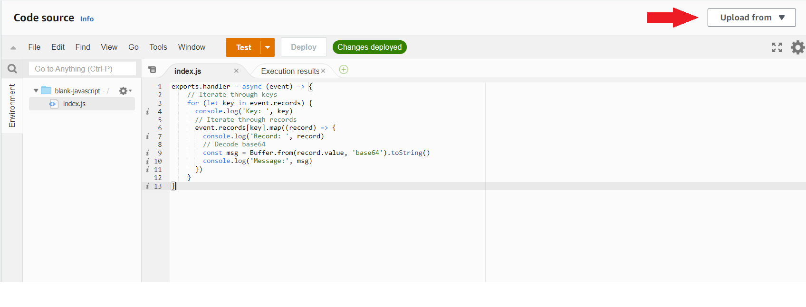

# kafka-node-faas-app
This is the implementation of the [PrimeStreamApp](https://github.com/TBolton2000/kafka-streams-app/blob/main/src/main/java/tbolton/PrimeStreamApp.java) from Apache Kafka Streams implemented as an AWS Lambda function.

This project is not complete, but some of the code could be used as a template for creating Lambda functions that are triggered by a Kafka broker.

To upload this as a AWS Lambda function run:
```
npm install
```

Then compress the entire folder as a `.zip` file with the dependancies installed.

Then `target/kafka-java-faas-app-1.0.jar` can be uploaded to AWS Lambda as a lambda function.

